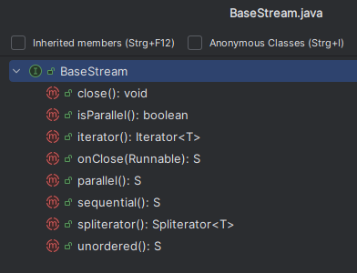
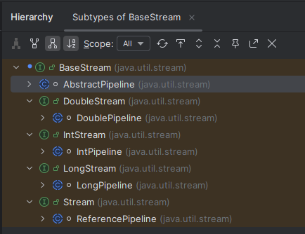

Idee: Wir wollen in Java so schöne Verkettungen bilden wir mit den Piepelines in der Shell bei Unix/Linux-Systemen.

Dazu erfinden wir einen Typ von Objekten, den wir Streams nennen und der eine Folge von Objekten order primitiven Typen darstellt.

In der Hierarchie beginnen wir mit einer Klasse java.util.BaseStream, die ein paar Grundeigenschaften von Streams enthält:

  
  
Streams enthalten eine Menge von irgendwelchen Objekte und haben einen Iterator und einen Spliterator dazu  
und können
  * parallel oder sequential
  * geordnet oder ungeordnet
  * offen oder geschlossen  

sein.

Im Unterschied zu Collections geht es bei Streams nicht um das Speichern der Elemente in Datenstrukturen sondern um die 
verarbeitung der Elemente in einer funktionalen Weise.  

Dabei werden auf einen Stream im Code sogenannten intermediate operations angewendet, die einen Stream aufnehmen und wieder  
einen Stream ausgeben. Sie bilden zusammen quasi die Pipeline (das "Rohr") und am Ende gibt es eine sogenante terminal-operation,  
die den Stream aufnimmt, aber dann ein nicht-Stream-Objekt auswirft (z.B. eine Collection oder ein anderes Objekt).
Die gesamte Pipeline wird von der JVM nicht Stück für Stück ausgeführt, sondern "lazily" in den Speicher geladen,  
um sie dann auszuführen, wenn die terminal operation ausgeführt werden soll.  

Beispiel für 

a) intermediate operatione:  
   ```Java
      map(), flatMap(), filter(), distinct(), sorted(), limit(), skip(), peek()
   ```
b) terminal operations:
   ```Java
     forEach(), toArray(), reduce(), collect(), min(), max(), count(), anyMatch(), allMatch(), noneMatch(), findFirst(), findAny()
   ```
    
<br/> 
<br/>
      
Es gibt Streams fuer Objekte und auch Spezialstreams für einfache Typen wie int, long oder double, die sich von BaseStream ableiten: 


  
In der Hierarchie sieht man auch die Ansätze für die Implementierungen von Streams im JDK, die dann "Pipeline" heißen.

Damit man mit Streams so coole Sachen machen kann wir mit den Pipelines in der Unix-Shell braucht man ein paar weitere coole Funktionen,
um die Streams zu filtern (wie mit grep) oder zu sortieren oder irgendwas zu zählen oder beliebig komplexe Operationen darauf anzuwenden
(wie mit sed oder awk z.B.) etc. 

Das sind die oben schon aufgezählten Funktionen filter(), map(), reduce() uw. die wir uns in der Folge ansehen wollen.


